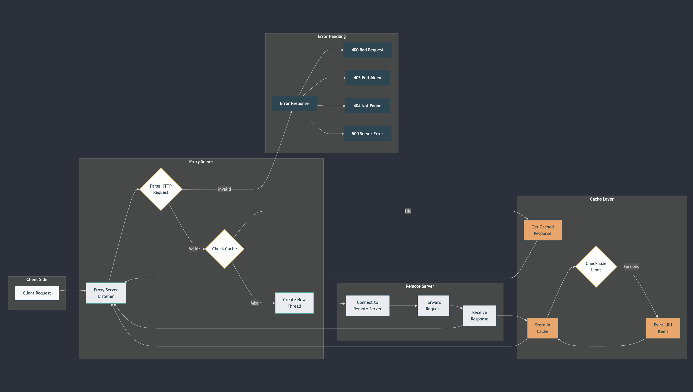
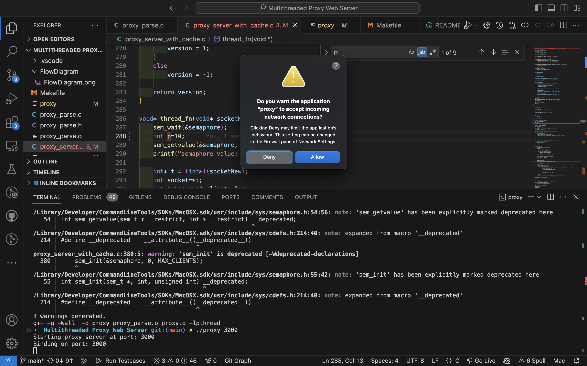
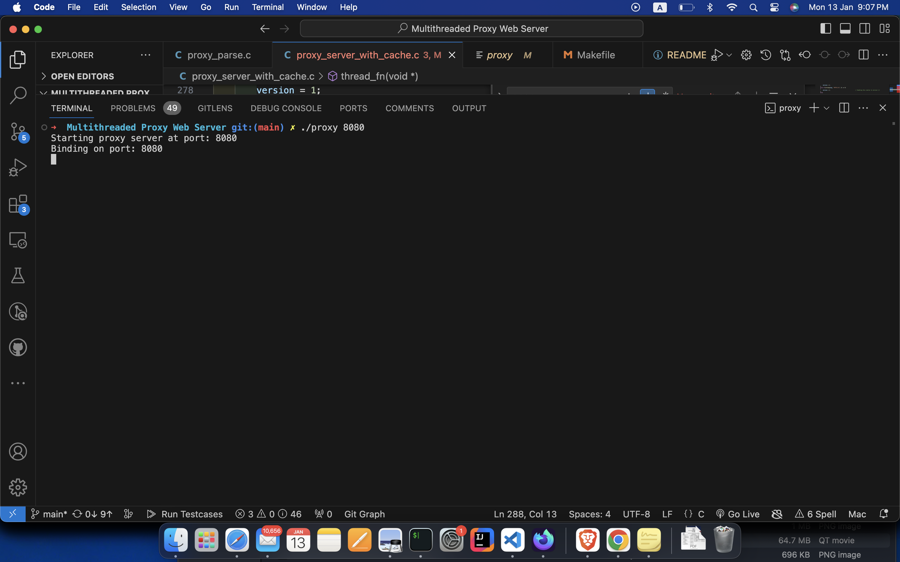
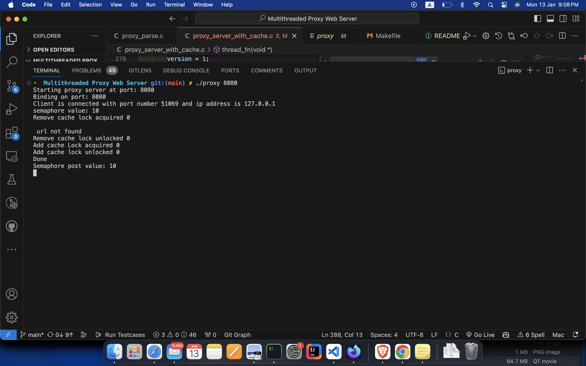
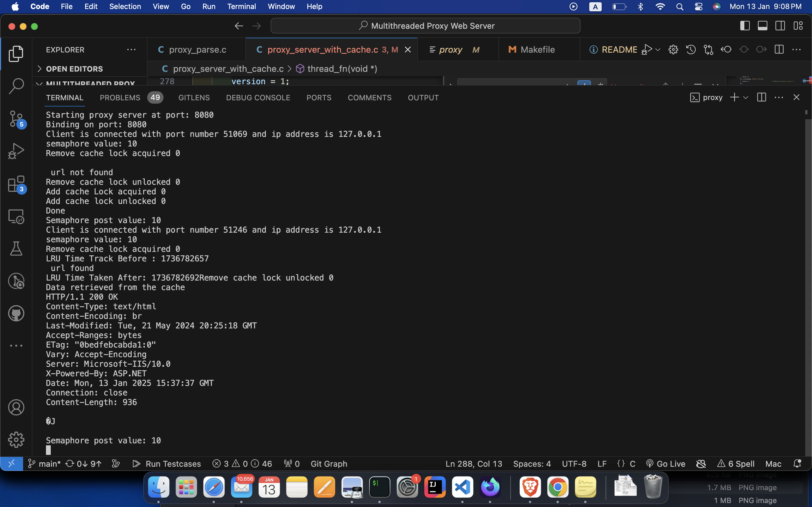
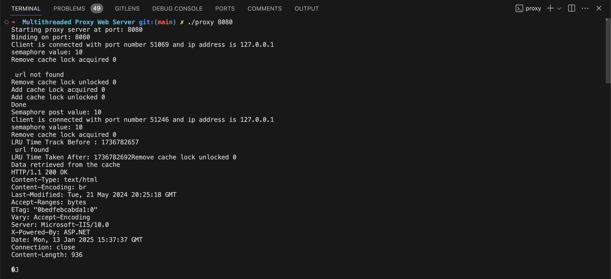

---

**Multithreaded Proxy Server with Caching**
---
Project Docs: https://deepwiki.com/mohitvdx/Multithreaded-Proxy-Web-Server


### Overview

This project implements a multithreaded HTTP proxy server capable of caching web responses and handling multiple client requests concurrently. It manages a connection pool, parses HTTP requests, and fetches responses from the remote server. It also features a caching mechanism to store frequently requested resources, reducing network traffic and improving latency for repeated client requests.

#### Key Features
- **Multithreading**: Supports concurrent client request handling using threads, enabling efficient resource management.
- **Caching**: Caches responses for frequently accessed URLs to minimize network overhead.
- **Error Handling**: Provides robust error handling with detailed HTTP status responses for common error codes like 400, 404, 500, etc.
- **Request Parsing**: Parses HTTP requests, ensuring proper formatting and header management for communication with the remote server.

---

### Project Structure
```
.
├── proxy_parse.h                # Header file containing function declarations for proxy operations
├── proxy_parse.c                # Contains the core logic for handling HTTP requests and responses
├── proxy_server_with_cache.c    # Main server code including connection management, multithreading, and caching logic
├── Makefile                     # Build script for compiling and linking the project
└── README.md                    # Project documentation (this file)
```

---
### Flow Diagram

<!--  -->
<div style="text-align: center;">
  
</div>


This diagram illustrates the process flow of how a client request is handled by the proxy server, from the initial request to response generation, caching, and error handling.

### Core Functions

#### `sendErrorMessage(int socket, int status_code)`
- **Description**: Sends a formatted HTTP error message for specified status codes like 400, 403, 404, 500, etc.
- **Arguments**:
  - `socket`: The socket descriptor for the client connection.
  - `status_code`: The HTTP error status code (e.g., 400, 404, etc.).
- **Returns**: 1 on success, -1 on failure.

#### `sendHttpErrorResponse(int socket, int status_code)`
- **Description**: Sends detailed error responses to the client, including the appropriate status message and HTML body content.
- **Arguments**:
  - `socket`: The socket descriptor for the client connection.
  - `status_code`: The HTTP error status code to be returned.
- **Returns**: 1 on success, -1 on failure.

#### `connectRemoteServer(char* host_addr, int port_num)`
- **Description**: Establishes a connection to a remote server for fetching resources.
- **Arguments**:
  - `host_addr`: The address of the remote server.
  - `port_num`: The port number to connect to.
- **Returns**: The socket descriptor on success, -1 on failure.

#### `handle_request(int clientSocket, ParsedRequest *request, char *tempReq)`
- **Description**: Processes the HTTP request, forwards it to the remote server, and sends the response back to the client.
- **Arguments**:
  - `clientSocket`: The socket descriptor for the client.
  - `request`: A structure containing parsed HTTP request details.
  - `tempReq`: A temporary request buffer.
- **Returns**: 0 on success, -1 on failure.

#### `checkHTTPversion(char *msg)`
- **Description**: Checks and validates the HTTP version in the incoming request message.
- **Arguments**:
  - `msg`: The HTTP request message.
- **Returns**: 1 for supported HTTP versions (1.0, 1.1), -1 for unsupported versions.

#### `thread_fn(void* socketNew)`
- **Description**: The function executed by each thread to handle client requests. It waits for the semaphore to ensure safe concurrent access and processes the incoming request.
- **Arguments**:
  - `socketNew`: A pointer to the socket descriptor for the client.
- **Returns**: None.

---

### Constants

- `MAX_CLIENTS`: Maximum number of concurrent client connections (default: 10).
- `MAX_BYTES`: Maximum allowed size of request or response (default: 4096 bytes).
- `MAX_SIZE`: Maximum size for the cache (default: 200 MB).
- `MAX_ELEMENT_SIZE`: Maximum size for an individual cached element (default: 10 MB).

---

### Data Structures

#### `cache_element`
A structure representing a cached response.

- **Fields**:
  - `data`: A pointer to the cached response data.
  - `len`: The length of the cached data.
  - `url`: The URL associated with the cached response.
  - `lru_time_track`: A timestamp for managing the least recently used (LRU) cache eviction policy.
  - `next`: A pointer to the next cache element in the linked list.

```c
struct cache_element {
    char *data;
    int len;
    char *url;
    time_t lru_time_track;
    cache_element *next;
};
```

---

### Dependencies

- **Standard Libraries**: `stdio.h`, `stdlib.h`, `string.h`, `unistd.h`, `time.h`, `errno.h`, `pthread.h`, `semaphore.h`.
- **Networking Libraries**: `sys/socket.h`, `netinet/in.h`, `arpa/inet.h`.

---

### Compilation and Build

To compile the proxy server, use the provided `Makefile` by running the following command:
```
make
```
This will compile the project and generate the executable `proxy` along with the necessary object files.

#### Makefile Details

The `Makefile` includes the following targets:

##### `all`
The default target that builds the proxy server executable.

```makefile
CC=g++
CFLAGS= -g -Wall

all: proxy

proxy: proxy_server_with_cache.c
	$(CC) $(CFLAGS) -o proxy_parse.o -c proxy_parse.c -lpthread
	$(CC) $(CFLAGS) -o proxy.o -c proxy_server_with_cache.c -lpthread
	$(CC) $(CFLAGS) -o proxy proxy_parse.o proxy.o -lpthread
```

##### `clean`
Removes all object files and the compiled executable.

```makefile
clean:
	rm -f proxy *.o
```

##### `tar`
Creates a tarball archive of the source code, including the proxy server files, `README`, `Makefile`, and header/source files.

```makefile
tar:
	tar -cvzf ass1.tgz proxy_server_with_cache.c README Makefile proxy_parse.c proxy_parse.h
```

---

### Usage

1. **Start the Proxy Server**: Run the compiled binary to start the proxy server on a specific port. For example:
   ```
   ./proxy 8080
   ```
   This will start the proxy server on port 8080. Ensure the server is accessible to clients.

2. **Connect Clients**: Clients can connect to the proxy server through the specified port (e.g., Open `http://localhost:8080/https://iiitbhopal.ac.in/#/website/home`). When clients request a web resource, the proxy will check if the resource is in the cache. If it is, it will return the cached data; otherwise, it will fetch the resource from the remote server.

3. **Manage Cache**: The server will cache responses for frequently accessed URLs, improving the speed and reducing the network traffic for repeated requests.

Note: Accept the below dialogue to allow setting up proxy server.

<div style="text-align: center;">
  
</div>

Note: Use incognito mode in browser to test the proxy server. So that browser cache will not be used.

---

### Terminal Output

<div style="display: grid; grid-template-columns: repeat(2, 1fr); gap: 15px; justify-items: center;">
  <div>
    
  </div>
  <div>
    
  </div>
  <!-- <div>
    
  </div>
  <div>
    
  </div> -->
  <div style="grid-column: span 2; text-align: center;">
    
  </div>
</div>


---

### Computer Science Fundamentals Used

1. **Multithreading**: Each incoming client request is processed in a separate thread, allowing the server to handle multiple client requests simultaneously. The use of threads ensures efficient resource utilization and faster response times. This is achieved using `pthread` library functions.

2. **Caching**: The project employs a caching mechanism to store frequently accessed resources. The LRU (Least Recently Used) policy is used to manage cache eviction, ensuring that the most recently accessed items remain in the cache, while less frequently accessed items are removed.

3. **Socket Programming**: The project utilizes low-level socket programming to establish communication between the client, proxy server, and remote server. This includes managing TCP/IP connections, parsing HTTP requests, and sending back HTTP responses.

4. **Error Handling**: Proper error handling ensures the system remains stable and responds with appropriate HTTP status codes when issues occur, such as malformed requests or connection failures.

5. **Concurrency Management**: Semaphores are used to ensure that shared resources, such as the cache, are accessed in a thread-safe manner, avoiding race conditions and ensuring data integrity.

---

### Error Handling

- The proxy server logs errors such as connection failures, request parsing issues, and cache management problems.
- Error codes are returned in the form of detailed HTTP status responses, including:
  - 400 Bad Request
  - 403 Forbidden
  - 404 Not Found
  - 500 Internal Server Error
  - 501 Not Implemented
  - 505 HTTP Version Not Supported

---

### Note

This project works better in linux/unix environment.

---

### Contributing

Contributions are welcome! If you'd like to contribute to this project, feel free to fork the repository and submit a pull request. Please ensure that your changes are thoroughly tested and documented.

---

### License

This project is licensed under the MIT License.

---
